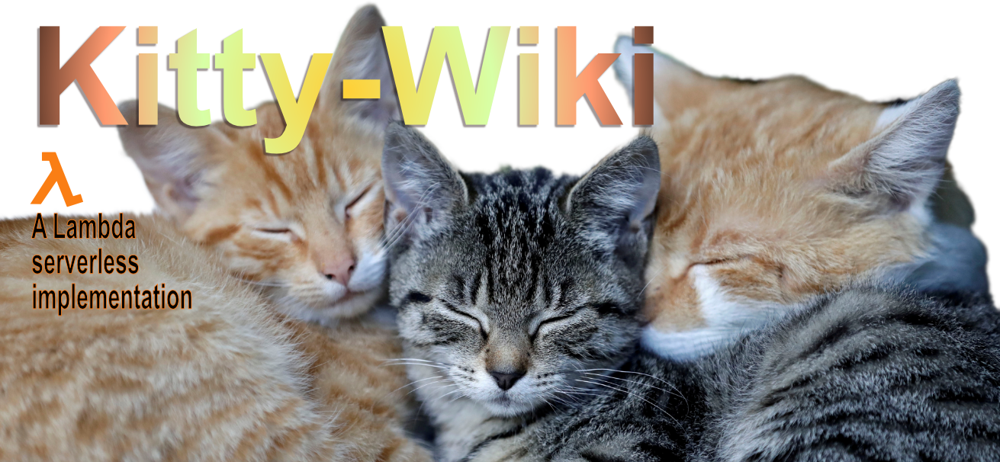
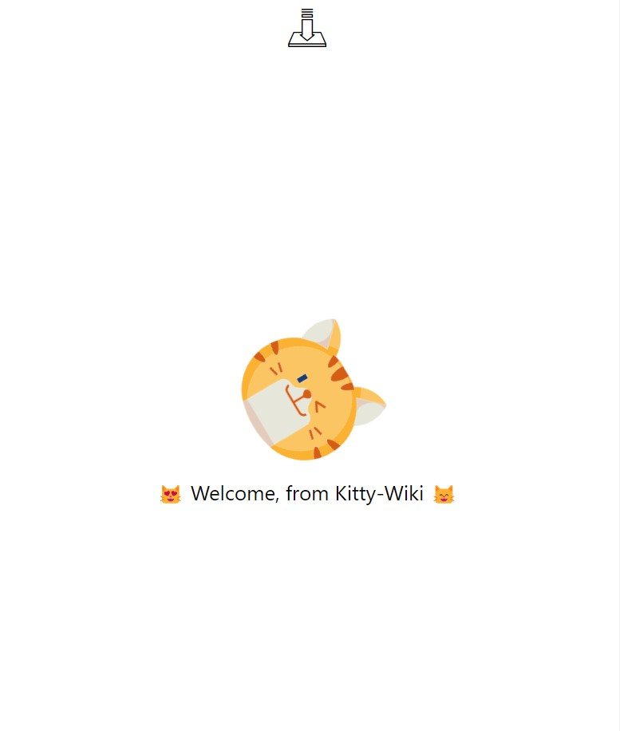

[](https://kitty-wiki.netlify.app)  [](https://github.com/Mark33Mark/catwiki_serverless)  

 
## Kitty-Wiki

### Table of Contents  
  
   1. [Project Description](#1-description)
   2. [User Story](#2-user-story)
   3. [Acceptance Criteria](#3-acceptance-criteria)
   4. [Installation](#4-installation)
   5. [Usage](#5-usage)
   6. [Credits](#6-credits)
   7. [License](#7-license)
   8. [Repository Status](#8-github-repo-status)
   9. [Contribute](#9-how-to-contribute)
   10. [Tests](#10-tests)
   11. [Checklist](#11-checklist)

---

### 1. Description  

**What is this project?**  

*  Simple application for cat lovers to review the 60+ breeds known in the world.  
   
   [Live application:  kitty-wiki.herokuapp.com]

     

**Why this project?**  

* I did this app as part of a job application - I didn't get the job - but I like the app I did.  So I'm keeping the app alive and I've refactored it to work as a Lambda serverless app so I can host it on Netlify.  All this because Heroku gave up providing free distos to the developer community on 26-Oct-2022.

---

### 2. User Story  

* AS a domestic cat lover and possibly interested in adding to my domestic cat family  
* I WANT to have a place to search all the known cat breeds in the world  
* SO THAT I can get more information on the different breeds.  


### 3. Acceptance Criteria

* GIVEN a landing page dedicated to domestic cat breeds  
* WHEN I search for cat breeds from the homepage and select a breed of my choice from the list  
* THEN I am taken to a new page that provides details specific to the breed I selected  
* WHEN seeing the page about the cat breed I selected I see more photos of the breed
* AND I see the breed details including description, temperament, origin, life span, adaptability, affection level, child-friendly, grooming, intelligence, health issues, social needs, stranger friendly.

---

### 4. Installation

You are welcome to download the source code from [my Github repository](https://github.com/Mark33Mark/catwiki)  

Once downloaded, you will need to install the dependencies with the following command in your terminal:  

```npm install```  


To run the application, type in the command line:

```npm start develop```  

Enjoy.  

---

### 5. Usage  

The code can be downloaded from [my Github repository](https://github.com/Mark33Mark/catwiki) for all assets created for the project.  

You are welcome to modify the code as you need as allowed by the [license](#7-license)

---

### 6. Credits  

* The Cat API: https://docs.thecatapi.com/  
* Let's Build UI: https://letsbuildui.dev/articles/building-a-dropdown-menu-component-with-react-hooks
* React online documentation.  
* Stack Overflow forums - huge gratitude to all the developers that give their time to answer questions on this forum.  

---

### 7. License  

 The works in this repository are subject to:  

[](doc/LICENSE.md)

---

### 8. Github repo status  


---

### 9. How to Contribute  

 If you would like to contribute, please comply with the Contributor Covenant Code of Conduct:  

[](doc/code_of_conduct.md)

---

### 10. Tests  

* Blowfish Studios provided 1 unit test that I've adapted however I ran out of time to set up any further tests.  

---

### 11. Checklist  

 All actions not checked are still to be completed:  

[x]  This application satisfies the following acceptance criteria:  
   *  Uses React for the front end.
   *  Uses Node.js and Express.js server.  
   *  Uses the Cat API.  
   *  Allows users to choose a cat breed from a drop down menu.  
   *  Breed details including description, temperament, origin, life span, adaptability, affection level, child-friendly, grooming, intelligence, health issues, social needs, stranger friendly is provided.  
[x]  Is an installable PWA application.
[x]  Application is deployed to Heroku [kitty-wiki.herokuapp.com](https://kitty-wiki.herokuapp.com).  
[x]  Application loads with no errors.  
[x]  User experience is intuitive and easy to navigate.  
[x]  User interface style is clean and polished.  
[x]  Application resembles the mock-up functionality provided by Blowfish Studios.  
[x]  GitHub repository contains application code.
[x]  Application is deployed to GitHub Pages: [Github location: https://github.com/Mark33Mark/catwiki](https://github.com/Mark33Mark/catwiki)  
[x]  Repository has a unique name.  
[x]  Repository follows best practices for class/id naming conventions, indentation, quality comments, etc.  
[x]  Repository contains multiple descriptive commit messages.  
[x]  Repository contains quality README file with description, screenshot, and link to deployed application: [Github location: https://github.com/Mark33Mark/catwiki](https://github.com/Mark33Mark/catwiki).  

---

[Back to the top](#kitty-wiki)  
